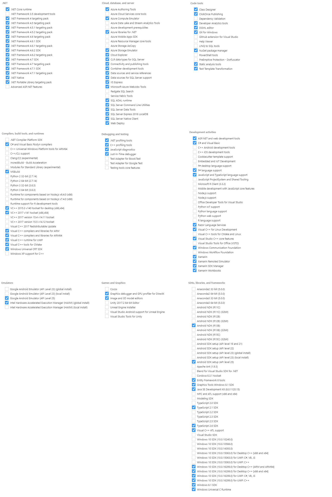

# Prepare your development environment

This document describes how to prepare your development environment to build and use the **Microsoft Azure IoT device client SDK for .NET**

1.  [Minimal Setup required to build IoT SDK](#min_setup)
2.  [Setting up a Windows development environment for debugging using Visual Studio 2017 - for development using Xamarin](#windows)

<a name="min_setup"/>

## Minimal setup required to build IoT SDK

### Windows + .NET Framework

- Install the latest .NET Core from https://dot.net
- Install .NET Framework 4.7 Developer Pack: https://support.microsoft.com/en-us/help/3186612/the-net-framework-4-7-developer-pack-and-language-packs
- Install .NET Framework 4.5.1 Developer Pack: https://www.microsoft.com/en-us/download/details.aspx?id=40772
- As admin (one-time setup):
    1. Enable Powershell script execution on your system. See http://go.microsoft.com/fwlink/?LinkID=135170 for more information.
    2. Run the following as admin: iothub\service\tests\prerequisites\windows_install.cmd

### Linux (tested on Ubuntu 16.04)

- Install Powershell https://github.com/PowerShell/PowerShell/blob/master/docs/installation/linux.md#ubuntu-1604
- Install .NET Core SDK CLI (min v2.0) https://www.microsoft.com/net/core#linuxubuntu

#### To clone the **master** use following command or simply download the **.zip** from [Azure IoT SDK][lnk-azure-iot] 

`git clone https://github.com/Azure/azure-iot-sdks.git`

Once cloned into local system, navigate to the root folder through Command Prompt, and run `build`.

<a name="windows"/>

## Setting up a Windows development environment for debugging using Visual Studio 2017

- Install [Visual Studio 2017][visual-studio]. You can use the **Visual Studio Community** Free download if you meet the licensing requirements.
- During installation of Visual Studio 2017, we found that selecting the following workloads and components helps in running and debugging the SDK.

Workloads:

Components:

#### To clone the **master** use following command or simply download the **.zip** from [Azure IoT SDK][lnk-azure-iot] 

`git clone https://github.com/Azure/azure-iot-sdks.git`

Once cloned into local system, navigate to the root folder through Command Prompt, and run `build`.
You can also build the application through Visual Studio, however, you'd have to integrate the `build` script in the project root folder with Visual Studio's build process.

### The built NuGet packages can be found under the bin folder. The folder contains both the NuGet packages and associated symbol packages.

[visual-studio]: https://www.visualstudio.com/
[readme]: ../readme.md
[lnk-sdk-vs2015]: http://go.microsoft.com/fwlink/?LinkId=518003
[lnk-sdk-vs2013]: http://go.microsoft.com/fwlink/?LinkId=323510
[lnk-sdk-vs2012]: http://go.microsoft.com/fwlink/?LinkId=323511
[lnk-visualstudio-xamarin]: https://msdn.microsoft.com/en-us/library/mt299001.aspx
[lnk-NuGet-package]:https://www.nuget.org/packages/Microsoft.Azure.Devices.Client
[lnk-NuGet-package_pcl]:https://www.nuget.org/packages/Microsoft.Azure.Devices.Client.PCL
[lnk-azure-iot]:https://github.com/Azure/azure-iot-sdks
[NuGet-Package-Manager]:https://visualstudiogallery.msdn.microsoft.com/5d345edc-2e2d-4a9c-b73b-d53956dc458d
[NuGet]:https://www.nuget.org/
[PCL]:https://msdn.microsoft.com/en-us/library/gg597391(v=vs.110).aspx
[UWP]:https://msdn.microsoft.com/en-us/windows/uwp/get-started/universal-application-platform-guide
[.NET]:https://www.microsoft.com/net
[UWP]:https://msdn.microsoft.com/en-us/windows/uwp/winrt-components/index
[Xamarin]:https://www.xamarin.com/